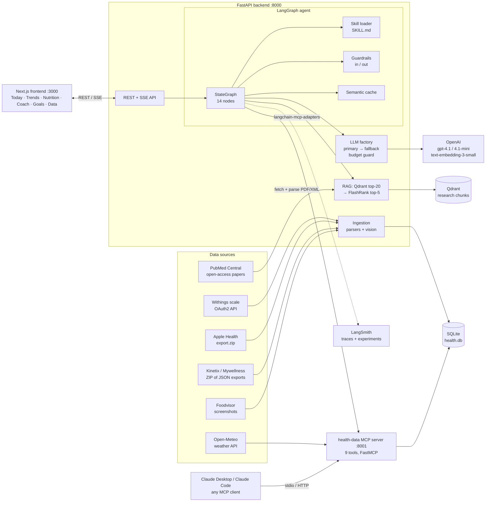
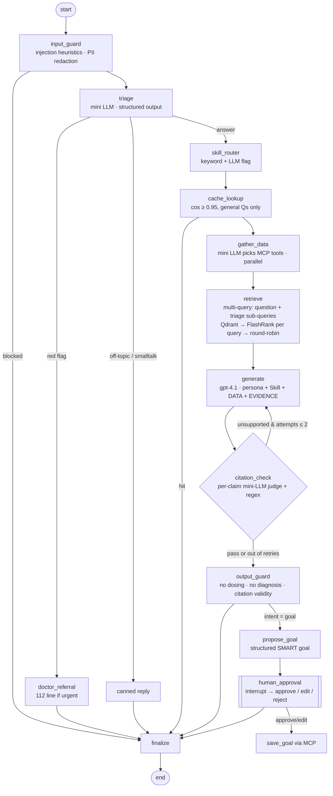

# Architecture — Bloom, a cycle-aware health coach

## 1. System overview

## 2. The agent graph (LangGraph)

| Requirement | Where |
|---|---|
| Branching | `triage` → doctor / canned / answer; `cache_lookup` → hit / miss; `output_guard` → goal / finalize |
| Loop | `citation_check` → `generate` (bounded: ≤ 2 rewrites, then a visible "unverified" note) |
| Human-in-the-loop | `human_approval` uses `interrupt()`; state persists in `AsyncSqliteSaver` between the two HTTP calls (`/api/chat` → `/api/chat/resume`) |

Code: `backend/app/agent/graph.py` · Mermaid export of the compiled graph: `docs/graph.mmd` · control-flow tests: `backend/tests/test_graph.py`.

## 3. One request, end to end

*"Is fasted morning cardio a bad idea for women with PCOS?"* — persona **Integrative Medicine**

1. **Frontend** `POST /api/chat {message, persona, thread_id}` and reads the SSE stream (`step`, `token`, `rewrite`, `interrupt`, `final`).
2. **input_guard** (0 ms, no LLM): no injection pattern; no PII.
3. **triage** (gpt-4.1-mini, structured `Triage`): `red_flag=false, intent=question, needs_research=true, needs_personal_data=false, womens_health_topic=true`, plus `search_queries=["fasted morning cardio women", "exercise interventions polycystic ovary syndrome", …]` → route `answer`.
4. **skill_router**: keywords `fasted`, `pcos`, `women` → loads `skills/womens-health-evidence/SKILL.md` into the system prompt.
5. **cache_lookup**: general question → embed and look up (miss the first time; the answer is cached after output_guard).
6. **gather_data**: skipped (no personal data needed) — for "…with my current training?" the mini model would call `get_cycle_status` + `get_workouts` over MCP.
7. **retrieve**: the question + each sub-query → Qdrant (20 / 10 candidates) → FlashRank per query → round-robin merge, ≤ 3 chunks per paper → top-5: Frampton 2022 (fasted RCT), Patten 2020 (PCOS exercise), Sims 2023 (ISSN female athlete)… Without sub-queries, only PCOS papers came back (see EVALS A/B 3).
8. **generate** (gpt-4.1, T = 0.3, streamed): answer with `[n]` citations and evidence-strength tags.
9. **citation_check** (gpt-4.1-mini, per-claim): every (sentence, [n]) pair is judged against passage n. Any overstated claim → targeted feedback → back to 8 (≤ 2 rewrites). v2 replaced a holistic verdict after the evals showed it was too lenient (citation precision 0.78 → 0.93).
10. **output_guard**: strips any supplement/medication dose, softens diagnoses, removes out-of-range citations, appends the disclaimer.
11. **finalize** → SSE `final` with answer, citations (title, section, page, DOI, passage) and the step trace, shown in the UI as "How I got here".

Every step is a LangSmith span (graph nodes, LLM calls, the `research_retriever`, MCP tool calls), tagged with persona and thread.

## 4. Components and deliberate choices

| Component | Choice | Why / alternatives rejected |
|---|---|---|
| Orchestration | **LangGraph** | Needed an explicit state machine with a *bounded loop* and a *durable interrupt* (HITL across HTTP requests). CrewAI's role/task abstraction hides the control flow we want to show and test; Parlant is guideline-centric, good for conversational policies but weaker for data pipelines + loops. LangGraph also gives LangSmith tracing for free. |
| Tools | **Own MCP server** (FastMCP, streamable HTTP, 9 tools) | Same tools serve the in-app agent *and* Claude Desktop/Code with zero glue. Tool schema + docstring = the contract the planner LLM reads. In-process fallback if the sidecar is down (`app/agent/tools.py`). |
| Skill | **`womens-health-evidence`** (Anthropic SKILL.md format) | Domain policy (evidence grading, PCOS nuances, red flags) lives in a versionable file that works in Claude Code *and* is loaded by the app only when triggered (progressive disclosure: ~1.5k tokens not paid on unrelated questions). |
| Data store | SQLite (WAL) | Single user, zero ops; shared by API + MCP via a volume. Postgres would be the move for multi-user. |
| Vector DB | **Qdrant** | Payload filtering, runs embedded (in-memory from a snapshot) for dev and as a server in Docker/Cloud with the same client code. pgvector would need Postgres; Chroma was a close alternative. |
| Embeddings | `text-embedding-3-small` (1536-d) | ~455 chunks → indexing cost < $0.01; quality sufficient with a reranker behind it. `-large` is 6.5× the price for a small gain on a tiny corpus. |
| Chunking | Section-aware, 450 tok / 60 overlap, contextual header | FlashRank truncates at 512 tokens, so larger chunks would be silently cut. Section-aware splits keep citations precise (section + page). The header ("ref — title \| section") is embedded but not shown, so short chunks still match topical queries. |
| Reranker | **FlashRank** ms-marco-MiniLM-L-12 (ONNX, CPU) | No extra API key, ~100 ms, fits in Docker. Measured in A/B #2. |
| Parsing | PyMuPDF (rawdict) + BeautifulSoup for JATS XML | Journal PDFs often omit space glyphs; we rebuild words from glyph gaps (glued-word rate went from up to 43 % to 0 %). XML is used when no PDF is open-access. |
| Multimodal | Vision extraction of Foodvisor screenshots | Foodvisor has no API/export: the screenshot is the *only* data channel. Output is schema-constrained, then sanity-checked (Atwater kcal ≈ 4C + 4P + 9F, item sum vs total), then confirmed by the user before saving. |
| Guardrails | Custom, rule-based in/out + LLM triage | Narrow threat model (single user, no browsing). Heuristics cost 0 ms and $0; semantic risk (red flags, off-topic) is handled by the triage LLM that has context. |
| Cache | Semantic cache (SQLite + numpy cosine) | Only for answers that used no personal data (these change daily). Threshold 0.95 is conservative: a wrong cached health answer costs more than a cache miss. |
| Fallback | `.with_fallbacks()` to the fallback model + daily budget | Outage or rate limit → degrade to mini rather than fail. Budget exceeded → primary role downgraded automatically. |
| Frontend | Next.js 15 + Tailwind v4 + Recharts + Framer Motion | "Calm wellness" design system; validated colorblind-safe series palette; cycle-phase shading on every time-series. |

## 5. Replaceable parts and deliberate coupling

- **Swappable via config**: models (`PRIMARY_MODEL`, `FAST_MODEL`, `FALLBACK_MODEL`), the vector store (`QDRANT_URL` empty → in-memory), MCP endpoint (`MCP_URL`), reranker (option `rerank`).
- **Swappable via one module**: each data source is an isolated parser in `app/ingest/` writing to the same tables.
- **Deliberate coupling**: the dashboard API and the MCP tools call the **same** `app/data/queries.py`, so the numbers the coach quotes are exactly the numbers on the charts. That is the property the numeric-accuracy eval relies on.
- **Single-vendor LLM risk** (OpenAI only, a project constraint): mitigated by LangChain's model abstraction; adding an Anthropic or Gemini fallback is one line in `app/llm.py`.

## 6. Trade-offs we accepted

| Trade-off | Decision |
|---|---|
| Quality vs latency | Citation-check loop adds ~1–3 s (plus a full rewrite when triggered) → accepted: a wrong citation in health advice is worse than a slower answer. Tokens stream during generation so perceived latency stays low. |
| Cost vs quality | Strong model only where the user reads the output (generate, goal); mini everywhere else. |
| Simplicity vs flexibility | Calendar-based cycle phase estimation instead of BBT/LH modelling; the estimate is flagged *low confidence* for irregular (PCOS) cycles rather than hidden. |
| Privacy | All health data stays in local SQLite; only the question, retrieved passages and the needed data summaries are sent to the LLM; PII redaction on input. |

## 7. Hypotheses that changed during the build

- *"Standard PDF extraction is fine"* → false: 6 of the 12 PDFs came out with 15–43 % glued words, which ruins embeddings. Fixed with glyph-gap reconstruction and a unit test that guards it.
- *"Fasted training is bad for women" is established* → the corpus says the evidence is **mixed and short-term**. The Skill now forces the agent to state evidence strength instead of repeating the popular claim.
- *"Cycle syncing" should drive training plans* → meta-analytic evidence shows trivial or inconsistent phase effects on strength. The coach personalises by symptoms and data, not by blanket phase rules.
- *"Embedding the user's question is enough"* → false for compound questions: "fasted cardio + women + PCOS" retrieved only PCOS papers. Fixed with triage-generated sub-queries and per-facet round-robin reranking (+0 LLM calls).
- *"One LLM verdict on the whole answer is a good citation check"* → false: it passed 95 % of answers while the offline evaluator found 22 % of citations unsupported. Per-claim checking fixed it (0.93).
- *"More reranking is free"* → re-ranking the whole multi-query pool against every query took 15 s on CPU. Re-ranking each query's own candidates gives the same result in 3.8 s.
- *"Each app is a separate data source"* → false with real exports: Mywellness mirrors the Apple Watch and Withings, and the Watch re-records gym visits. A cross-source dedupe step after every import became necessary, as did timezone normalisation (Apple exported everything as +05:00).
- *Embedded Qdrant on disk* → it holds an exclusive file lock, which breaks running the API and the evals at the same time. Switched to in-memory Qdrant loaded from an index snapshot (server Qdrant in Docker).
