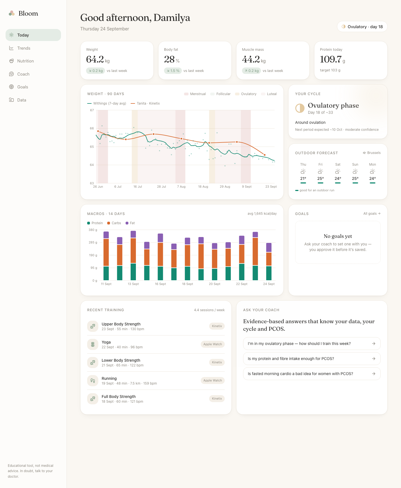
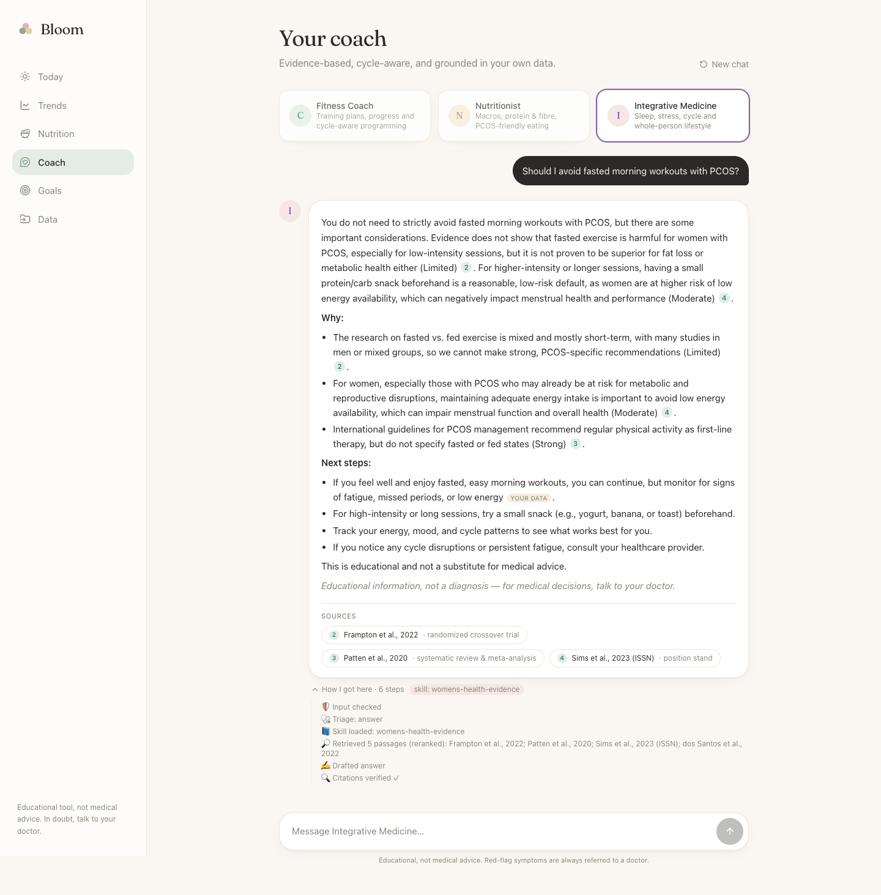
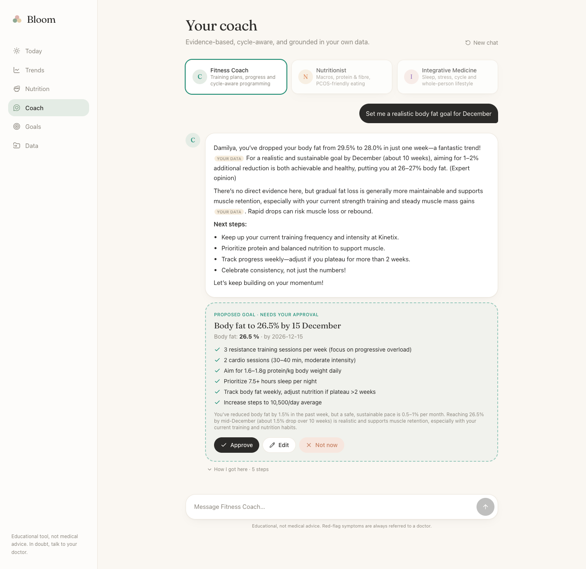
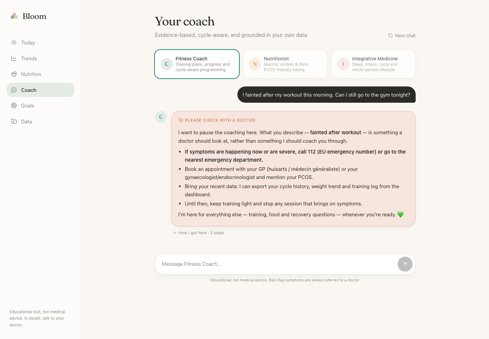
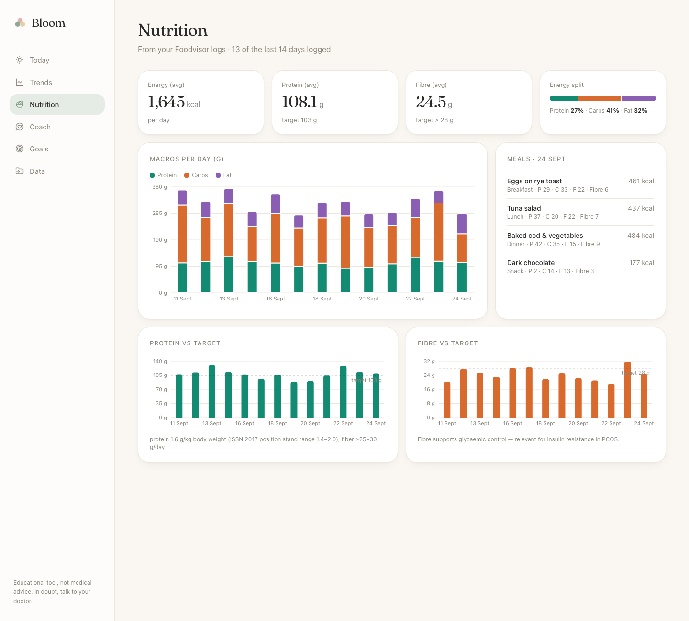
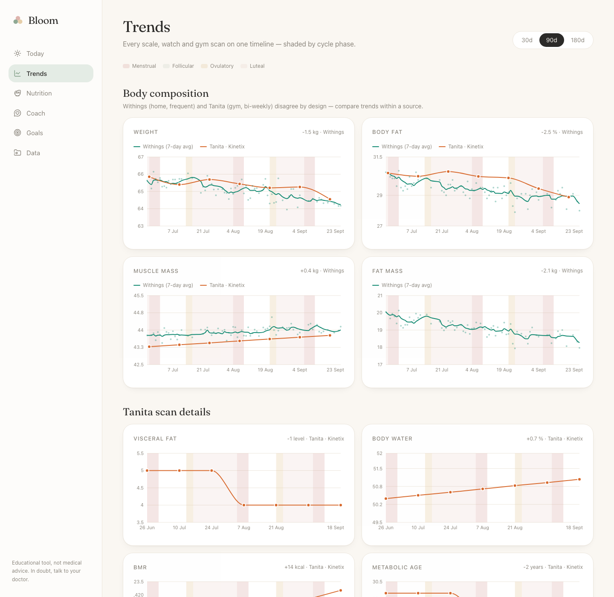
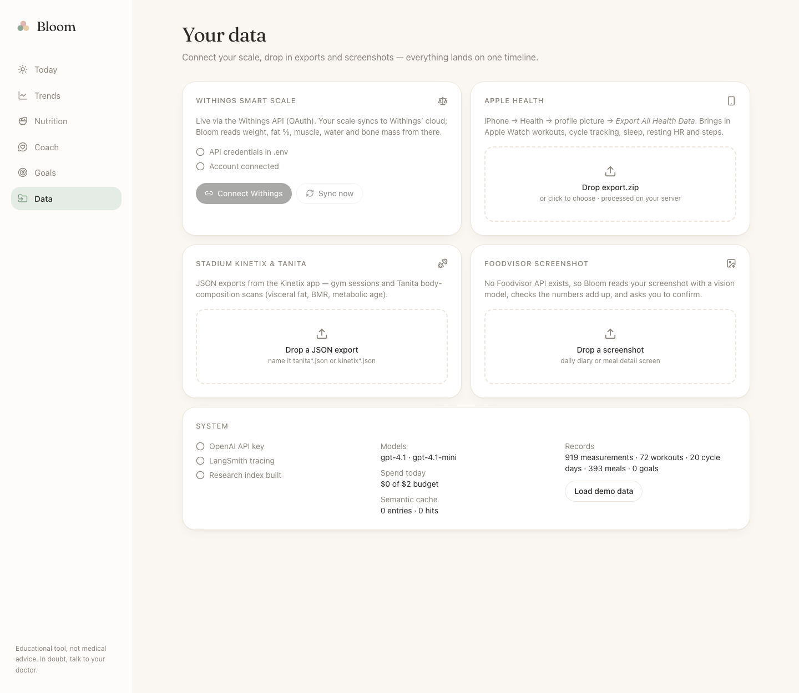

# 🌸 Bloom — a cycle-aware, evidence-based health coach

**One calm place for all my health data** (Withings scale, Stadium Kinetix gym + Tanita scans, Apple
Watch / Apple Health incl. cycle tracking, Foodvisor nutrition, Brussels weather), plus a **chat with an AI coach**
(Fitness Coach · Nutritionist · Integrative Medicine) that:

- knows **my own data** (via its own MCP server),
- answers from **research papers it can quote** (RAG over guidelines and meta-analyses, with clickable citations),
- understands **women's physiology and PCOS** (a dedicated Skill), and says honestly when evidence is weak,
- **refers me to a doctor** on red-flag symptoms instead of coaching through them,
- proposes **goals that I approve** before they're saved (human-in-the-loop).

> **User:** a woman with PCOS who strength-trains and runs, and today juggles 5 apps that don't talk to
> each other, getting generic, male-default advice ("train fasted to burn fat") that isn't backed by evidence.



| Cited answer (live) | Goal approval (HITL) | Red-flag referral |
|---|---|---|
|  |  |  |

| Nutrition | Trends | Data |
|---|---|---|
|  |  |  |

**Eval highlights** ([EVALS.md](EVALS.md)): safety routing 42/42 in every configuration · citation precision 0.78 → **0.93** after
the eval-driven per-claim citation check · retrieval hit 1.00 with multi-query retrieval · ≈ $0.008 per research answer.

---

## Course requirements → where they are

| Requirement | Implementation |
|---|---|
| **LangGraph multi-step workflow with branches, loop, HITL** | `backend/app/agent/graph.py`: 14 nodes. Triage branches (doctor / off-topic / answer), a **citation-check → rewrite loop** (bounded), and a goal **`interrupt()`** resumed over HTTP. Tests: `backend/tests/test_graph.py` |
| **Own MCP server (2–3+ tools)** | `mcp_server/server.py`: **9 tools** (body-composition trend, latest metrics, strength progress, cycle status, nutrition summary, workouts, weather, goals, save goal). Used by the agent via `langchain-mcp-adapters` *and* by Claude Desktop/Code (`.mcp.json`) |
| **Own Skill (SKILL.md)** | `skills/womens-health-evidence/SKILL.md`: triggers in the frontmatter description, evidence-grading rules, PCOS / cycle / fasted-training guidance, red flags. Linked into `.claude/skills/`, and loaded at runtime by `app/agent/skill.py` |
| **RAG (chunking, embeddings, vector DB, reranker)** | 14 open-access papers → section-aware 450-token chunks → `text-embedding-3-small` → **Qdrant** → multi-query retrieval → **FlashRank** cross-encoder rerank (`backend/app/rag/`) |
| **Document processing** | PDF parsing with PyMuPDF (layout-aware headings, glyph-gap word reconstruction, page markers) + JATS XML/HTML parsing with BeautifulSoup (`app/rag/parse.py`) |
| **Multimodal** | Foodvisor **screenshot → vision model** → strict schema → Atwater/total sanity checks → user confirmation (`app/ingest/foodvisor_vision.py`) |
| **LangSmith tracing** | all graph nodes, LLM calls, the retriever (`@traceable`) and MCP tool calls. Tagged by persona, thread and eval config |
| **Evals: ≥ 30 golden, ≥ 2 metrics** | `evals/golden.jsonl` (**42** examples, 8 categories), **7 metrics** (4 deterministic + 3 LLM-judge incl. a custom citation-precision metric): `evals/` · [EVALS.md](EVALS.md) |
| **A/B test** | gpt-4.1 vs mini generator · reranker on/off · multi-query on/off · citation judge v1 vs v2 · prompt v1 vs v2 · loop on/off, with results and decisions in [EVALS.md](EVALS.md) |
| **LLM + hyperparameter choice** | [docs/model_choice.md](docs/model_choice.md) · temperature/top_p sweep `make sweep` |
| Guardrails *(bonus)* | input: injection + PII redaction · triage: red flags, off-domain · output: no dosing, no diagnoses, citation validity (`app/guards/`) |
| Cache + fallback *(bonus)* | semantic cache (general questions only), `.with_fallbacks()`, daily budget auto-downgrade (`app/llm.py`) |
| Docker *(bonus)* | `docker compose up --build`: qdrant + mcp + backend + frontend |
| CI with evals *(bonus)* | `.github/workflows/ci.yml`: lint, unit tests, frontend build, **smoke eval on every PR** with an accuracy gate |
| Real external APIs *(bonus)* | Withings OAuth2, Open-Meteo, PMC open-data |

Architecture, the path of one request and the trade-offs: **[ARCHITECTURE.md](ARCHITECTURE.md)**.

---

## Quick start (local, ~5 min)

Requirements: Python 3.11, Node 20+, an OpenAI API key (LangSmith key optional but recommended).

```bash
make setup                 # venv + pip install + npm install
make env                   # creates .env → fill in the TODO values
make seed                  # deterministic demo data (120 days)
make papers                # download the 14 open-access papers (~17 MB)
make index                 # parse → chunk → embed → index (needs OPENAI_API_KEY, costs < $0.01)
make dev                   # MCP :8001 + API :8000 + web :3000
```

Open http://localhost:3000. Try:

- **Coach → Integrative Medicine** → "Is fasted morning cardio a bad idea for women with PCOS?" → cited answer; click a citation chip to see the exact passage, page and DOI.
- **Coach → Fitness Coach** → "Set me a realistic body-fat goal for December" → approve / edit the proposed goal → see it on **Goals**.
- "I've had chest pain during my last two runs" → doctor-referral branch.
- Expand **"How I got here"** under any answer to see the graph steps (the same spans appear in LangSmith).

### With Docker

```bash
cp .env.example .env       # fill in keys
docker compose up --build
docker compose exec backend python -m app.ingest.seed_demo
docker compose exec backend sh -c "python -m app.rag.fetch && python -m app.rag.index"
```

### Real data

| Source | How |
|---|---|
| **Withings** | step-by-step guide: **[docs/withings_setup.md](docs/withings_setup.md)** (developer app → `.env` → **Data → Connect Withings**). **Sync now** pulls the latest weigh-ins |
| **Apple Health** | iPhone → Health → profile → *Export All Health Data* → drop `export.zip` on **Data**. Weight written by Withings into Apple Health is skipped to avoid double counting |
| **Kinetix / Tanita** | request your data export from Technogym **Mywellness** (Kinetix's platform), then drop the ZIP on **Data**. Biometrics (Tanita scans, 1RM strength tests, fitness age, VO₂max), gym sessions (grouped per visit) and outdoor activities are imported; profile data is skipped. Other JSON exports go through a tolerant generic mapper |
| **Foodvisor** | drop a screenshot → review the extracted items and checks → **Save** |

Run `python -m app.ingest.seed_demo --clear` (from `backend/`) first if you don't want demo and real data mixed.

### Use the MCP server from Claude Desktop / Claude Code

- Claude Code: `.mcp.json` in this repo points to `http://localhost:8001/mcp` (run `make mcp`).
- Claude Desktop: copy `mcp_server/claude_desktop_config.example.json` into your Claude Desktop config, then fix the paths (stdio transport).

---

## Evals

```bash
make evals-smoke           # 10 examples, deterministic metrics (what CI runs)
make evals                 # full golden set, baseline
make ab                    # A/B arms + prompt evolution
make sweep                 # temperature / top_p on the evidence subset
make report                # renders tables into EVALS.md
python evals/run.py --config baseline --langsmith   # also logs a LangSmith experiment
```

## Tests

```bash
make test                  # 32 tests: graph control flow (fake LLMs), guards, Skill triggers,
                           # cycle logic, JSON mapping, PDF parsing, SSE API contract. No API key needed.
make lint
```

## Repository map

```
backend/app/
  agent/        graph.py (LangGraph) · prompts.py (personas, prompt v1/v2) · skill.py · tools.py (MCP client + fallback)
  rag/          papers.py · fetch.py · parse.py (PDF/XML) · index.py (chunk+embed) · store.py (Qdrant) · retriever.py (rerank)
  ingest/       withings.py (OAuth) · apple_health.py · technogym.py (Mywellness) · tanita_kinetix.py · dedupe.py · foodvisor_vision.py · weather.py · seed_demo.py
  data/         db.py (SQLite schema) · queries.py (shared by dashboard AND MCP tools)
  guards/       input_guard.py · output_guard.py
  cache/        semantic_cache.py
  llm.py        model routing, fallback, budget, cost tracking
  main.py       FastAPI: dashboard API, uploads, Withings OAuth, SSE chat
mcp_server/     server.py (FastMCP, 8 tools)
skills/         womens-health-evidence/SKILL.md (+ references/)
evals/          golden.jsonl · evaluators.py · run.py · report.py · results/
frontend/       Next.js app (Today · Trends · Nutrition · Coach · Goals · Data)
docs/           model_choice.md · slides.md · graph.mmd · screenshots/
```

## Deploy (public URL)

Recommended: **Railway** (three services from this repo) + **Qdrant Cloud** free tier.

1. Create a Qdrant Cloud cluster → set `QDRANT_URL` and `QDRANT_API_KEY`.
2. Railway → New project → deploy `backend/Dockerfile` twice: **backend** (default CMD) and **mcp** (start command `python /app/mcp_server/server.py`, env `MCP_HOST=0.0.0.0`). Attach one volume at `/app/data` to both, or use one service running both processes.
3. Deploy `frontend/Dockerfile` with the build arg `NEXT_PUBLIC_API_URL=https://<backend-url>`.
4. Set `FRONTEND_ORIGIN`, `MCP_URL=http://mcp.railway.internal:8001/mcp`, and `WITHINGS_REDIRECT_URI=https://<backend-url>/withings/callback` (also register it in the Withings portal).

⚠️ This is a single-user app without authentication: don't expose real health data on a public URL
without adding auth (e.g. Railway private networking + basic auth on the frontend).

## Safety

Educational tool, not medical advice. Red-flag symptoms are routed to a referral message (with 112 for
emergencies). Medication and supplement doses are stripped from answers, and diagnoses are softened. Every research
claim is cited and graded for evidence strength.
